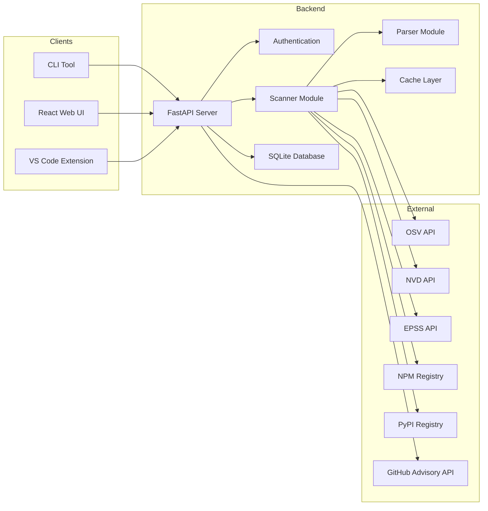

# Cipher

A dependency vulnerability scanner that checks package manifests against the OSV API to identify known security vulnerabilities.

---

## Project Overview

Cipher scans dependency files across multiple package ecosystems (npm, PyPI, Go, Maven, NuGet, RubyGems, Cargo) and reports known security vulnerabilities by querying the Open Source Vulnerabilities (OSV) database. The project provides three interfaces: a CLI tool for local scanning, a FastAPI backend with a React web UI, and a VS Code extension for in-editor diagnostics.

The scanner extracts package names and versions from manifest and lock files, queries the OSV API for vulnerability data, and enriches results with additional context from the NVD database and Exploit Prediction Scoring System (EPSS). It supports multiple output formats including SARIF for GitHub code scanning integration, SPDX and CycloneDX for SBOM generation, and CSV/HTML for reporting.

The backend uses SQLite for persistent scan history and user accounts, with JWT-based authentication supporting both email/password and Google OAuth. Anonymous users receive a limited number of daily scans, while registered accounts have unlimited access. The CLI supports ecosystem auto-detection, lock file parsing, severity filtering, and CI/CD exit codes for build failures.

---

## Key Features

### Multi-Ecosystem Support
- Parses manifest files for npm (package.json, package-lock.json, yarn.lock, pnpm-lock.yaml), Python (requirements.txt, Pipfile, pyproject.toml), Go (go.mod), Rust (Cargo.toml), Ruby (Gemfile.lock), Maven (pom.xml), and NuGet (packages.config, .csproj)
- Auto-detects project ecosystem from directory structure
- Supports monorepo detection for pnpm workspaces, Lerna, Nx, and Turbo

### Vulnerability Scanning
- Queries OSV.dev API for vulnerability data using batch queries (up to 100 packages per request)
- Enriches CVE entries with CVSS scores and vectors from NVD API
- Fetches EPSS (Exploit Prediction Scoring System) scores and percentiles for CVEs
- Implements retry logic with exponential backoff for API failures
- Caches scan results to reduce redundant API calls

### Analysis and Reporting
- Classifies severity as Critical, High, Medium, or Low based on CVSS scores
- Computes package health scores (0-100) considering vulnerability count, severity, license type, and maintenance status
- Detects unmaintained packages (no updates for 2+ years) by querying package registries
- Provides fix suggestions by querying npm and PyPI registries for latest versions
- Classifies upgrade risk as safe (patch), minor, or breaking based on semver changes

### Output Formats
- CLI output in table format (default), JSON, summary, HTML, SPDX, CycloneDX, SARIF, or CSV
- Web UI with severity filtering, sortable results, and export buttons
- SARIF format compatible with GitHub code scanning upload
- SPDX 2.3 and CycloneDX 1.5 SBOM generation

### Authentication and History
- SQLite database for user accounts and scan history
- Email/password authentication with bcrypt hashing
- Google OAuth 2.0 integration for sign-in
- JWT tokens with 24-hour expiration
- Rate limiting on registration, login, and anonymous account creation
- Anonymous users receive 5 daily scan credits with 24-hour reset
- Registered users have unlimited scans

### VS Code Extension
- Inline diagnostics in package.json and other manifest files
- Activity bar view showing vulnerability details
- Commands for scanning files, clearing diagnostics, and account management
- Configuration options for server URL, minimum severity, and scan-on-save behavior

### CI/CD Integration
- GitHub Actions workflow that runs scans and uploads SARIF results
- CLI option to fail builds based on vulnerability severity (--fail-on)
- Support for posting scan results as GitHub PR comments

---

## Architecture



### Backend Components

- **main.py**: FastAPI application with endpoints for scanning, authentication, scan history, exports, and news feed
- **scanner.py**: Core scanning logic with OSV API integration, batch queries, concurrent processing (max 20 concurrent), and result composition
- **parsers/**: Ecosystem-specific parsers for extracting dependencies from manifest files
- **account.py**: User authentication, JWT token management, credit system, and rate limiting
- **history.py**: SQLite operations for saving and retrieving scan history
- **fixer.py**: Queries package registries for latest versions and generates fix suggestions
- **license.py**: Fetches license and last-updated metadata from npm and PyPI registries
- **health.py**: Computes health scores based on vulnerability severity, license type, and maintenance status
- **sbom.py**: Generates SPDX 2.3 and CycloneDX 1.5 SBOM documents
- **export.py**: Generates SARIF and CSV export formats
- **report.py**: Generates HTML reports
- **news.py**: Fetches recent security advisories from GitHub Advisory Database with 5-minute cache
- **pr_comment.py**: Formats and posts scan results as GitHub PR comments
- **monorepo.py**: Detects monorepo configurations (pnpm, Lerna, Nx, Turbo)
- **tree.py**: Builds dependency trees from lock files

### Frontend Components

- React 19 with TypeScript
- Vite for build tooling
- TailwindCSS for styling
- Components for scanning interface, results dashboard, severity charts, history view, and authentication modals
- Server-sent events (SSE) for real-time scan progress updates

### Database Schema

SQLite database with two tables:
- **users**: id, email, password_hash, created_at, credits, credits_updated_at, is_anonymous, oauth_provider, oauth_sub, last_scan_at
- **scans**: id, timestamp, user_id, project_name, total_packages, vulnerable_packages, total_vulnerabilities, severity breakdowns, results_json, fixes_json

---

## Installation

### From Source

```bash
git clone https://github.com/zoulevanz23/cipher.git
cd cipher
pip install -r requirements.txt
```

### Web UI Setup

```bash
# Backend
python -m uvicorn vulnchecker.main:app --reload --host 0.0.0.0 --port 8000

# Frontend
cd frontend
npm install
npm run dev
```

Access the web UI at `http://localhost:5173`

---

## CLI Usage

### Basic Scan

```bash
# Scan current directory (auto-detects ecosystem)
cipher --path .

# Scan with lock file for exact versions
cipher --path . --lock-file

# Filter by minimum severity
cipher --path . --min-severity high
```

### Output Formats

```bash
# Table (default)
cipher --path . --format table

# JSON
cipher --path . --format json -o results.json

# Summary
cipher --path . --format summary

# SBOM formats
cipher --path . --format spdx -o sbom.json
cipher --path . --format cyclonedx -o sbom.json

# SARIF for GitHub
cipher --path . --format sarif -o results.sarif
```

### CI/CD Integration

```bash
# Fail build if high or critical vulnerabilities found
cipher --path . --fail-on high

# Fail on any vulnerability
cipher --path . --fail-on any
```

### Ecosystem Specification

```bash
cipher --path /path/to/project --ecosystem pip
cipher --path /path/to/project --ecosystem go
cipher --path /path/to/project --ecosystem cargo
```

### Configuration

Create a `.cipherrc` file in your project root:

```json
{
  "min_severity": "medium",
  "ignore": ["GHSA-xxxx-xxxx-xxxx"],
  "ignore_until": {"GHSA-yyyy-yyyy-yyyy": "2024-12-31"},
  "ecosystem": "npm",
  "use_lock_file": true
}
```

---

## Environment Variables

```bash
# Backend
CIPHER_SERVER_URL=http://localhost:8000
CIPHER_GOOGLE_CLIENT_ID=your_google_client_id
CIPHER_JWT_SECRET=your_jwt_secret
OSV_API_URL=https://api.osv.dev/v1
GITHUB_TOKEN=your_github_token

# Frontend
VITE_GOOGLE_CLIENT_ID=your_google_client_id
```

---

## CI/CD Example

```yaml
name: Security Scan

on:
  push:
    branches: [main]
  pull_request:
  schedule:
    - cron: '0 6 * * 1'

jobs:
  security-scan:
    runs-on: ubuntu-latest
    steps:
      - uses: actions/checkout@v3
      - name: Install Cipher
        run: pip install -r requirements.txt
      - name: Scan dependencies
        run: python -m cipher --path . --format json --output results.json
      - name: Upload SARIF
        uses: github/codeql-action/upload-sarif@v2
        with:
          sarif_file: results.json
```

---

## Development

### Running Tests

```bash
pytest vulnchecker/tests/
```

### Project Structure

```
cipher/
├── vulnchecker/          # Python backend
│   ├── main.py          # FastAPI server
│   ├── cli.py           # CLI interface
│   ├── scanner.py       # OSV API integration
│   ├── parsers/         # Ecosystem parsers
│   ├── scanners/        # NVD enrichment
│   ├── account.py       # Authentication
│   ├── history.py       # Scan history
│   └── tests/           # pytest tests
├── frontend/            # React web UI
│   ├── src/
│   │   ├── components/
│   │   └── api/
│   └── package.json
├── vscode-vulnchecker/   # VS Code extension
│   ├── src/
│   └── package.json
└── requirements.txt
```

---

## License

MIT

---

## Repository

https://github.com/zoulevanz23/cipher
